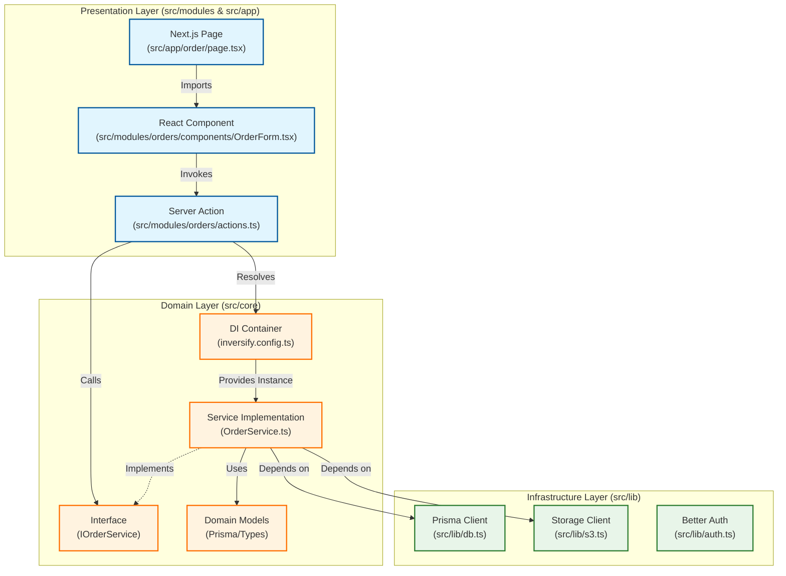

# Architecture Overview

## High-Level Architecture

This project follows a **Modular Vertical Slice Architecture** combined with a **Layered Core** for business logic. This approach ensures high cohesion for features while maintaining clean separation of concerns for the domain logic.

### Architectural Layers



## Folder Structure

```text
src/
├── app/                        # Next.js App Router (Routes & Pages)
│   ├── (public)/               # Public facing routes
│   │   ├── catalog/
│   │   ├── order/
│   │   └── page.tsx
│   ├── admin/                  # Admin protected routes
│   │   ├── orders/
│   │   └── products/
│   ├── api/                    # API Routes (Auth, Webhooks)
│   └── layout.tsx
│
├── modules/                    # FEATURE MODULES (Vertical Slices)
│   ├── orders/                 # Everything related to Orders
│   │   ├── components/         # UI: OrderForm, OrderTable
│   │   ├── actions.ts          # Server Actions: createOrder
│   │   ├── schema.ts           # Zod Schemas: createOrderSchema
│   │   └── types.ts            # Feature-specific types
│   │
│   ├── products/               # Everything related to Products
│   │   ├── components/         # UI: ProductCard, ProductForm
│   │   ├── actions.ts
│   │   └── schema.ts
│   │
│   ├── gallery/
│   └── users/
│
├── core/                       # CORE BUSINESS LOGIC (The "Domain")
│   ├── services/               # Service Interfaces & Implementations
│   │   ├── OrderService.ts
│   │   ├── ProductService.ts
│   │   └── StorageService.ts
│   ├── di/                     # Dependency Injection Setup
│   │   ├── container.ts        # Inversify Container
│   │   └── types.ts            # DI Tokens/Identifiers
│   ├── errors/                 # Custom App Errors
│   └── utils/                  # Shared pure functions
│
├── lib/                        # INFRASTRUCTURE / ADAPTERS
│   ├── db.ts                   # Prisma Client instance
│   ├── auth.ts                 # Better Auth configuration
│   ├── s3.ts                   # S3 Client setup
│   └── validations/            # Shared generic validation rules
│
└── components/                 # SHARED UI (Design System)
    ├── ui/                     # Shadcn/UI primitives (Button, Input)
    ├── layout/                 # Header, Footer, Sidebar
    └── providers/              # React Context Providers
```

## Key Concepts

### 1. Feature Modules (`src/modules/*`)
We organize code by **feature** (Vertical Slice) rather than by type.
- **High Cohesion**: Everything needed for a feature (UI, Actions, Validation) is in one place.
- **Isolation**: Modules should not depend heavily on other modules. They communicate via the Core Domain Layer.

### 2. Core Domain (`src/core/*`)
This contains the "Business Brain" of the application.
- **Services**: Classes that implement `IInterface` and contain the actual logic (e.g., `calculatePrice`, `validateInventory`).
- **Dependency Injection**: We use **InversifyJS** to decouple the implementation from the interface. This allows us to swap `RealProductService` with `MockProductService` for testing or development.

### 3. Server Actions as Controllers
Next.js Server Actions (`actions.ts` in modules) act as the **Entry Points** (Controllers).
- They receive data from the client.
- They validate input using **Zod schemas**.
- They call the appropriate **Service** from the DI Container.
- They return the result (or error) to the UI.

### 4. Validation Strategy
- **Zod** is used for runtime validation.
- Schemas are defined in `schema.ts` within each module.
- We validate **at the boundary**:
    - In Server Actions (before hitting the database).
    - In Forms (React Hook Form resolver).

### 5. Data Access
- **Prisma** is used as the ORM.
- The `PrismaClient` is injected into Services.
- **Rule**: UI components and Server Actions should **never** use Prisma directly. They must go through a Service.

